# 📊 SAV (Sorting Algorithm Viewer)


## 📋 Introdução
O projeto visa desenvolver um **visor de algoritmos e ordenação**, um algorítmo que localiza os elementos de uma lista em uma certa ordem.

## 🌟 Funcionalidades
A ideia é poder mostrar visualmente como a lista **muda** em cada iteraçao, de acordo com o algoritmo de ordenação. Exemplo:


### 🧮 Ordenações utilizadas:
- **Bubble Sort**: Pequenas e frequentes trocas de elementos adjacentes. A lista gradualmente se ordena de trás para frente.
- **Insertion Sort**: Elementos são movidos e inseridos gradualmente na posição correta. A parte ordenada cresce à medida que o algoritmo avança.
- **Quick Sort**: Segmentos da lista são ordenados em diferentes pontos, com partições visíveis onde o pivô divide a lista.
- **Selection Sort**: O menor elemento é selecionado e trocado com o elemento na posição inicial da parte não ordenada da lista.

### 🧱 Em construção:
- No fim da ordenação, mostrar o tempo de execução até a ordenação da lista (sem contar com a pausa).
- Ajustar o layout do painel de ordenação. (detalhes)
- Exibir o array (em barras no SortPanel) de entrada, antes da ordenação.
- Melhorar visual do painel de controle.
- Opção de pausar a ordenação. (?)

## ⚙️ Diagrama de Classe

```mermaid
classDiagram
    direction LR

    class DataGenerator {
        +static int[] randomNumbers(numElements: int): int[]
        +static char[] randomChars(numElements: int): char[]
    }


    class MainApp {
        +main(args: String[]): void
    }

    class ArgumentProcessor {
        +processArguments(args: String[]): ProcessedArgs
    }

    class ProcessedArgs {
        +String algorithm
        +String type
        +String order
        +String valueListType
        +int numElements
        +String manualValues
        +int pauseDuration
        +ProcessedArgs(algorithm: String, type: String, order: String, valueListType: String, numElements: int, manualValues: String, pauseDuration: int)
    }

    class UtilitiesCLI {
        +static void getEffectGraphics()
        +static void getMessageUses()
        +static void showTitle()
    }

    class InputValidator {
        +static boolean validateInput(algorithm: String, type: String, order: String, valueList: String): boolean
        +static String getAlgorithmFullName(algorithm: String): String
        +static String getTypeFullName(type: String): String
        +static String getOrderFullName(order: String): String
        +static String getValueListFullName(valueList: String): String
        +static int[] manualInputIntArray(input: String): int[]
        +static char[] manualInputCharArray(input: String): char[]
    }

    class SortController {
        +SortController(panel: SortPanel, pauseDuration: int, order: String)
        +bubbleSort(array: int[])
        +bubbleSort(array: char[])
        +selectionSort(array: int[])
        +selectionSort(array: char[])
        +insertionSort(array: int[])
        +insertionSort(array: char[])
        +quickSort(array: int[], low: int, high: int)
        +quickSort(array: char[], low: int, high: int)
        -panel: SortPanel
        -pauseDuration: int
        -ascending: boolean
    }

    class SortViewerFrame {
        +SortViewerFrame()
        +startSorting()
        -sizeField: JTextField
        -pauseField: JTextField
        -algorithmBox: JComboBox
        -typeBox: JComboBox
        -orderBox: JComboBox
        -valueListBox: JComboBox
        -control: SortController
        -panel: SortPanel
    }

    class ButtonUtil {
        +ButtonUtil(text: String, action: ActionListener)
        -text: String
        -action: ActionListener
    }

    class SortHandler {
        -control: SortController
        -panel: SortPanel
        +SortHandler(control: SortController, panel: SortPanel)
        +void sort(algorithm: String, array: int[])
        +void sort(algorithm: String, array: char[])
    }

    class Sorting {
        <<abstract>>
        +Sorting(panel: SortPanel, ascending: boolean, pauseDuration: int)
        +sort(array: int[])
        +sort(array: char[])
        -executeSort(array: int[])
        -executeSort(array: char[])
        -highlightBar(index: int)
        -sleep()
        -panel: SortPanel
        -ascending: boolean
        -pauseDuration: int
    }

    class BubbleSort {
        +BubbleSort(panel: SortPanel, ascending: boolean, pauseDuration: int)
        +sort(array: int[])
        +sort(array: char[])
        -executeSort(array: int[])
        -executeSort(array: char[])
    }

    class SelectionSort {
        +SelectionSort(panel: SortPanel, ascending: boolean, pauseDuration: int)
        +sort(array: int[])
        +sort(array: char[])
        -executeSort(array: int[])
        -executeSort(array: char[])
    }

    class InsertionSort {
        +InsertionSort(panel: SortPanel, ascending: boolean, pauseDuration: int)
        +sort(array: int[])
        +sort(array: char[])
        -executeSort(array: int[])
        -executeSort(array: char[])
    }

    class QuickSort {
        +QuickSort(panel: SortPanel, ascending: boolean, pauseDuration: int)
        +sort(array: int[])
        +sort(array: char[])
        -executeSort(array: int[])
        -executeSort(array: char[])
        -quickSortHelper(array: int[], low: int, high: int)
        -partition(array: int[], low: int, high: int): int
        -quickSortHelper(array: char[], low: int, high: int)
        -partition(array: char[], low: int, high: int): int
    }

    class SortPanel {
        +setIntArray(array: int[])
        +setCharArray(array: char[])
        +setCurrentBar(index: int)
        -paintComponent(g: Graphics)
        -updateBuffer()
        -drawArray(g: Graphics, int, int)
        -getMaxValue(array: int[]): int
        -getMaxValue(array: char[]): int
        -intArray: int[]
        -charArray: char[]
        -isCharArray: boolean
        -buffer: BufferedImage
        -barSpacing: int
        -currentBar: int
    }

    MainApp --> ArgumentProcessor : Uses
    MainApp --> SortViewerFrame : Calls
    ArgumentProcessor --> ProcessedArgs : Creates
    ArgumentProcessor --> UtilitiesCLI : Uses
    ArgumentProcessor --> InputValidator : Validates

    SortHandler --> SortController : Uses
    SortHandler --> SortPanel : Uses
    DataGenerator --> SortViewerFrame : Uses
    SortViewerFrame --> InputValidator : Uses
    SortViewerFrame --> SortController : Uses

    SortController --> Sorting : Uses
    Sorting <|-- BubbleSort : Inherits
    Sorting <|-- SelectionSort : Inherits
    Sorting <|-- InsertionSort : Inherits
    Sorting <|-- QuickSort : Inherits
    SortPanel <-- Sorting : Uses

    SortController --> SortPanel : Uses
    SortViewerFrame --> ButtonUtil : Uses
    SortViewerFrame --> SortPanel : Uses

```


## 🛠️ Implementação
- **Linguagem de Programação:** Java
    - **Versão utilizada:** JDK 17
- **Interface Gráfica:** Swing
- **Controle de Versão:** Git

## 📈 Ordenação Visual (Interface Gráfica)
Agora você irá visualizar em tempo real os diferentes tipos de ordenação dos elementos (`Bubble Sort`, `Insertion Sort`, `Quick Sort`, `Seletion Sort`).

### 🔝 Você deve entrar com os parâmetro via CLI!
Abra o terminal e navegue até a pasta do projeto (caso não esteja), e execute os seguintes comandos:

- #### Compilação:
  Foi usado o arquivo `Makefile` para automatizar o processo de compilação. Para executá-lo basta por `make` no terminal.
  ```bash
    make
  ```
- #### Execução (Exemplo):
    - aleatório (caracteres)
      ```bash
        java -cp out main.java.MainApp a=b t=c o=az in=r r=20 s=100
      ```
    
    - aleatório (números)
      ```bash
        java -cp out main.java.MainApp a=q t=n o=az in=r r=50 s=100
      ```
    
    - manual (caracteres)
      ```bash
        java -cp out main.java.MainApp a=s t=c o=za in=m v="H,r,x,C,Q,L,w,o,c,z,M,g,p,z,b,R,a,h" s=100
      ```
    
    - manual (números)
      ```bash
        java -cp out main.java.MainApp a=i t=n o=za in=m v="-21,50,-3,2,7,17,23,-15,38,12,-4,47,31,0,-10" s=100
      ```
`Path: src/main/java/MainApp.java`

## 📝 Licença
Este projeto é licenciado sob a Licença MIT - veja o arquivo [LICENSE](LICENSE) para mais detalhes.
