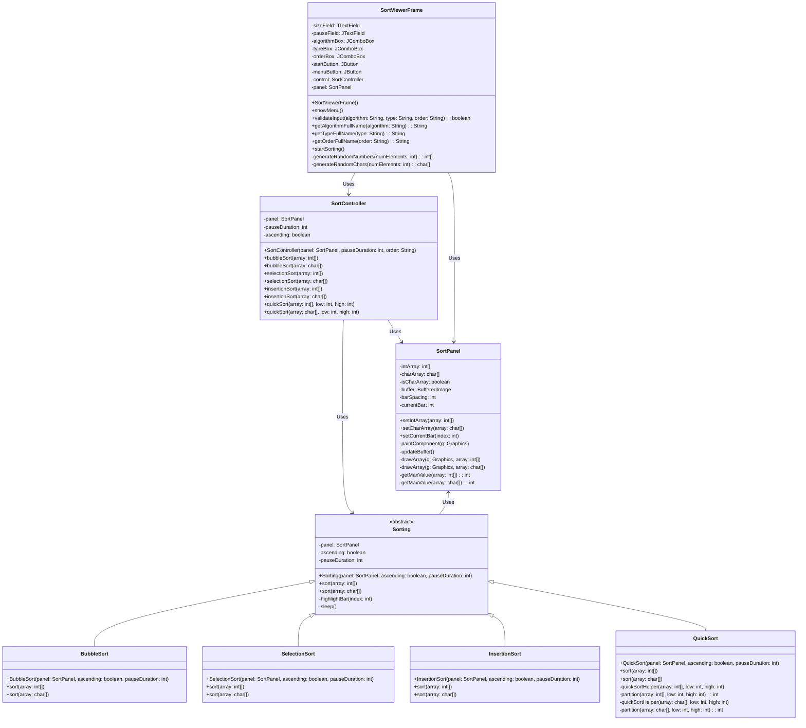

# 📊 SAV (Sorting Algorithm Viewer)

## 📋 Introdução
O projeto visa desenvolver um **visor de algoritmos de ordenação**, um algorítmo que localiza os elementos de uma lista em uma certa ordem.

## 🌟 Funcionalidades
A ideia é poder mostrar visualmente como a lista **muda** em cada iteraçao, de acordo com o algoritmo de ordenação. Exemplo:

## ⚙️ Diagrama de Classe

## 🛠️ Implementação
- **Linguagem de Programação:** Java
- **Interface Gráfica:** Swing
- **Controle de Versão:** Git

## 📈 Ordenação Visual (Interface Gráfica)
Para visualizar em tempo real os diferentes tipos de ordenação dos elementos (`Bubble Sort`, `Insertion Sort`, `Quick Sort`, `Seletion Sort`), execute a classe principal do projeto: `MainApp`.

`Path: src/main/java/MainApp.java`
